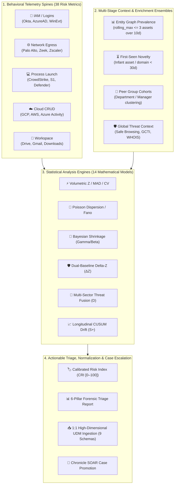

# 🚀 Google SecOps Multi-Stage Risk Metrics Threat Hunter (v1.0.0)
## *Agentic Behavioral Baselining, Multi-Stage DAG Analytics & Interactive UEBA Engine*

**Author**: Greg Kushmerek  
**Target Platform**: Google Security Operations (Chronicle SIEM & SOAR)  
**Specification**: YARA-L 2.0 Multi-Stage Directed Acyclic Graph (DAG) Pipeline Engine  
**Release Date**: August 2026  

---

## 🗺️ 1. High-Level Skill Capability Architecture

The **SecOps Multi-Stage Risk Metrics Skill** (`secops-risk-metrics-multistage`) bridges the gap between raw Google SecOps telemetry and advanced behavioral threat hunting. It decouples high-volume raw log processing from statistical evaluation by chaining pre-computed Risk Analytics baselines (`metrics.*`) with downstream mathematical models and contextual entity graph enrichment.



---

## 🏛️ 2. The Foundation: Risk Metrics & Multi-Stage Data Composition

* **$O(1)$ Constant-Time 30-Day Baselines**: Rather than scanning petabytes of raw historical event logs across a 30-day window, Stage 1 executes an $O(1)$ lookup against Google SecOps pre-computed behavioral tables (`metrics.*`). This instantly extracts historical averages ($\mu$), standard deviations ($\sigma$), active observation days ($N$), and historical peak maximums.
* **Universal 6-Point Outcome Contract**: Standardizes all Stage 1 extractors into a uniform 6-tuple outcome (`$observed_val`, `$historical_avg`, `$historical_stddev`, `$historical_active_days`, `$historical_max`, `$historical_sum`) to guarantee seamless plug-and-play mathematical composability with any downstream statistical model.
* **Composing Additional Datasets Across Subsequent Stages**:
  * **Entity Graph Derived Context**: Pre-computed fleet prevalence (`graph.entity.<type>.prevalence.rolling_max <= 3`) and novelty timestamps (`first_seen_time`, `last_seen_time`).
  * **Global Context & Threat Feeds**: Safe Browsing hashes, GCTI indicators, and WHOIS domain age.
  * **Cross-Domain Telemetry Fusion**: Joins independent orthogonal pipelines (IAM + Endpoint + Network + Cloud CRUD + Workspace) into a single unified threat score.

---

## 🧮 3. Statistical Models Taxonomy & Multi-Stage Query Mapping

The skill provides 14 rigorous mathematical models mapped to distinct multi-stage query architectures:

| Statistical Model Family | Mathematical Formulation | Multi-Stage DAG Architecture | Query Mapping & Template Routing |
| :--- | :--- | :--- | :--- |
| **1. Standard $Z$-Score** | $Z = \frac{X - \mu}{\sigma + 1.0}$ | 2-Stage DAG (Extract $\to$ Rank) | `network_bytes_outbound.yl2` + `standard_z_score.yl2` |
| **2. Robust MAD** | $M_Z = \frac{0.6745 \cdot (X - \tilde{X})}{\text{MAD} + 1.0}$ | 2-Stage DAG (Extract $\to$ Robust Rank) | `http_queries_total.yl2` + `mad.yl2` |
| **3. Coefficient of Variation ($CV$)** | $CV = \frac{\sigma}{\mu + 1.0}$ | 2-Stage DAG (Instability Scoring) | `auth_attempts_total.yl2` + `coefficient_of_variation.yl2` |
| **4. Hourly Temporal $Z$-Score** | $Z_{\text{hour}} = \frac{X_h - \mu_h}{\sigma_h + 1.0}$ | 2-Stage DAG (Hourly Bucket Join) | `auth_attempts_fail.yl2` + `hourly_temporal_zscore.yl2` |
| **5. Poisson Dispersion (Fano Factor)** | $F = \frac{\sigma^2}{\mu + 1.0}$ | 2-Stage DAG (Clustering Engine) | `auth_attempts_fail.yl2` + `variance_fano.yl2` |
| **6. Discrete Poisson Rarity** | $Z_P = \frac{k - \lambda}{\sqrt{\lambda + 1.0}}$ | 2-Stage DAG (Rarity on Quiet Hosts) | `file_executions_total.yl2` + `poisson_rarity.yl2` |
| **7. Poisson-Gamma Conjugacy** | $\mathbb{E}[\lambda \mid k] = \frac{\alpha_0 + k}{\beta_0 + 1}$ | 2-Stage DAG (Prior/Evidence Weight) | `dns_queries_total.yl2` + `poisson_gamma_bayesian.yl2` |
| **8. Beta-Binomial Failure Rate** | $\hat{p}_{\text{post}} = \frac{\alpha_0 + k_{\text{fail}}}{\alpha_0 + \beta_0 + N}$ | 2-Stage DAG (Ratio Regularization) | `auth_attempts_fail.yl2` + `beta_binomial_bayesian.yl2` |
| **9. Dual-Baseline Delta-$Z$ ($\Delta Z$)** | $\Delta Z = Z_{\text{Personal}} - Z_{\text{Fleet Today}}$ | 3-Stage DAG (Host + Fleet $\to$ Root) | `pipelines/dual_baseline_delta_z_3stage.yl2` |
| **10. Hierarchical Empirical Bayes** | $\lambda_{\text{post}} = (1 - B)\bar{X}_i + B\mu_{\text{cohort}}$ | 3-Stage DAG (Host + Cohort $\to$ Root) | `pipelines/hierarchical_empirical_bayes_3stage.yl2` |
| **11. 4-Stage Multi-Sector Fusion** | $D = \sqrt{Z_{\text{Auth}}^2 + Z_{\text{Proc}}^2 + Z_{\text{Net}}^2}$ | 4-Stage DAG (3 Sectors $\to$ Root) | `pipelines/multi_sector_fusion_4stage.yl2` |
| **12. 360° Omnibus Entity Radar** | $D_{\text{360}} = \sqrt{\sum_{i=1}^5 Z_i^2}$ | 6-Stage DAG (5 Telemetry Sectors) | `pipelines/omnibus_radar_6stage.yl2` |
| **13. Longitudinal CUSUM Drift** | $S_t^+ = \max(0, S_{t-1}^+ + Z_t - k)$ | Multi-Day Longitudinal DAG | `pipelines/longitudinal_cusum_timeline.yl2` |
| **14. Entity Graph Rarity Outlier** | Baseline $Z$ + $\text{Prevalence} \le 3$ | 2-Stage Decoupled Derived Context | `file_executions_total.yl2` + `entity_prevalence_filter.yl2` |

---

## 💬 4. Interactive Natural-Language-to-Statistical-Engineering Workflow

* **Conversational Intent Translation**: Security analysts do not need to construct complex mathematical queries or remember metric names. The skill automatically parses qualitative, operational language (e.g. *"bursts"*, *"rare domains"*, *"newly active users"*, *"low and slow"*, *"peer group comparison"*) and routes it to the exact mathematical model and `.yl2` template.
* **Mandatory Step 1 Pre-Flight Safety Protocol (Zero Execution on Turn 1)**:
  1. **Zero Unsolicited Execution**: Strictly enforces a hard turn boundary on Turn 1—no background searches, ingestion calls, or data mutations occur prior to explicit user clearance.
  2. **Plain-English Cyber Analogies**: Explains the mathematical methodology using intuitive physical analogies (*The Seasoned SOC Detective*, *The Patch Tuesday Earthquake Shield*, *The Combined Arms Threat Radar*).
  3. **Structured Pre-Flight Hunting Specification Card**: Explicitly displays Target Scope, Baseline Horizon, Peer Roster ($N$), and Entity Graph Dimensions.
  4. **Upfront Literal YARA-L Query Preview**: Displays the exact multi-stage query in markdown directly on Turn 1.
  5. **Interactive Mode Selection**: Consultatively prompts the analyst to choose between **Mode A (24-Hour Snapshot fleet ranking)** and **Mode B (14-Day Longitudinal Timeline with inception chart)**.

---

## 🎯 5. Core UEBA Use Cases Supported

1. **Dormant Account & Credential Abuse**: Identifies quiet service accounts or users suddenly generating massive authentication volume or executing privileged commands.
2. **Departmental / Peer Group Drift (Insider Threat)**: Flags individuals deviating significantly from their team cohort (e.g., Frank vs. IT Department peers) without generating false positives on team-wide operations.
3. **Coordinated Multi-Vector Killchains**: Fuses low-level anomalies across authentication failures, rare process execution, and staging network egress into a single composite incident score ($D$).
4. **Targeted Intrusions vs. Macro Fleet Spikes (Patch Tuesday Immunity)**: Subtracts company-wide surges (software updates, cloud migrations) to isolate genuine targeted anomalies ($\Delta Z$).
5. **Low-and-Slow Data Siphoning**: Accumulates subtle, sub-threshold daily data exfiltration across 14–30 days using CUSUM control charts, pinning the exact inception date.
6. **LOLBin & Rare Binary Outliers**: Discovers rare administrative utilities or unapproved binaries executed on quiet servers where historical arrival is near zero ($\lambda \le 2.0$) and enterprise prevalence is $\le 3$ hosts.

---

## 🛡️ 6. Analytical Rigor & Data Integrity Guarantees

* **Universal Dispersion Floor ($\sigma_{\text{floor}} = 1.0$)**: Applied to all $Z$-score denominators ($Z = \frac{X - \mu}{\sigma + 1.0}$), eliminating division-by-zero on quiet accounts and preventing infinite false positives.
* **Full Population Preservation (No Inner-Join Drops)**: Evaluates 100% of fleet entities and captures all contacted destinations using array aggregations (`array_distinct(target.hostname)`), guaranteeing that non-threat high-volume hosts are never dropped.
* **Sparse Baseline Caution & Floor ($N \ge 7$)**: Enforces an active-day floor and applies Empirical Bayes shrinkage to regularize sparse or newly onboarded accounts toward their peer group norm.
* **Cartesian Join Product Prevention**: Prevents $N \times M$ row inflation by isolating distinct event categories into separate stages before vector fusion.
* **10-Day Prevalence Platform Invariant**: Hard-anchors Entity Graph prevalence to Chronicle’s immutable 10-day lookback window (`day_count = 10`), while offering asset threshold adjustments (`rolling_max <= N`) or 30-day First-Seen novelty.
* **1:1 High-Dimensional UDM Ingestion & Catch-All Case Promotion**: Emits discrete synthetic UDM events per outlier ($Z \ge 3.0\sigma$, $\text{CRI} \ge 50$) across **9 specialized `product_event_type` schemas**, automatically promoted to Chronicle SOAR cases via tenant catch-all rules.
* **Zero Script Hallucination Guarantee**: Strict prohibition against generating raw event dumps or running local Python simulation scripts; 100% of statistical baselines are computed natively in Google SecOps.

---

## 📊 7. Declarative Charting & Visualization Specs for JavaScript Clients

The skill includes standardized visual data contracts and declarative chart generators (`references/chart-specifications-guide.md` and `scripts/chart_generator.py`) optimized for **Vega-Lite (v5)**, **Chart.js**, and modern web-based SIEM/SOC dashboards:

1. **Strict Axis-Type Isolation Invariants**:
   * **Left Y-Axis (Linear Volume)**: Exclusively quantitative linear counts/bytes (`quantitative` in Vega-Lite / `type: "linear"` in Chart.js).
   * **Right Y-Axis (Statistical Deviation)**: Exclusively standardized scores ($Z$-score $\sigma$, Threat Distance $D$, or Calibrated Risk Index $\text{CRI}$).
   * **X-Axis (Timeline / Entity)**: Exclusively temporal ISO timestamps (`temporal` / `type: "time"`) or nominal host/user identifiers (`nominal` / `type: "category"`).
   * **Error Prevention**: Guarantees categorical entity strings never collide with numeric quantities on the Y-axes.
2. **Standard Visualization Archetypes**:
   * **30-Day Behavioral Baseline Envelope**: Visualizes the entity's 30-day baseline mean line with a shaded $\mu \pm 3\sigma$ confidence band alongside daily observed activity to highlight burst inception points.
   * **Dual-Axis Volume vs. Anomaly Score Chart**: Plots volume bars on the left axis against statistical deviation markers on the right axis with a dashed red line at the $3.0\sigma$ significance boundary.


---

## 🧪 8. Quality Assurance & Test Verification

* **63 Automated Unit Tests (100% Passing in 0.15s)**: Complete test coverage across guardrail contracts, statistical edge cases, template syntax, and schema completeness.
* **Live-Validated on Production SecOps Tenants (`gus-sdl`)**: Validated on real multi-sector DAG queries, Entity Graph joins, and longitudinal timeline searches.

---

## 📚 9. Appendix: Ready-to-Run Sample Prompts & Literal YARA-L 2.0 Queries

### 🧪 Sample 1: Workstations Executing Rare Binaries (Entity Graph Prevalence)
* **Analyst Prompt**: 
  > *"Hunt across the fleet for workstations with abnormal file execution spikes compared to their historical baseline that are launching rare binaries."*
* **Multi-Stage Architecture**: 2-Stage DAG (`PROCESS_LAUNCH` Baseline + Entity Graph File Prevalence Join).
* **Literal YARA-L 2.0 Query**:
```yara
// Stage 1: 30-Day File Execution Baseline per Host & Hash
stage stage1_extract {
    metadata.event_type = "PROCESS_LAUNCH"
    $event_type = metadata.event_type
    principal.asset.hostname = $host
    principal.process.file.sha256 = $sha256
    $host != ""
    $sha256 != ""

  match:
    $host, $sha256 by 1d

  outcome:
    $observed_executions = count(metadata.id)
    $sample_command = array_distinct(principal.process.command_line)
    $sample_path = array_distinct(principal.process.file.full_path)
    $distinct_users = count_distinct(principal.user.userid)

    $historical_avg = max(metrics.file_executions_total(
        period: 1d, window: 30d, metric: event_count_sum, agg: avg,
        metadata.event_type: $event_type,
        principal.asset.hostname: $host,
        principal.process.file.sha256: $sha256
    ))
    $historical_stddev = max(metrics.file_executions_total(
        period: 1d, window: 30d, metric: event_count_sum, agg: stddev,
        metadata.event_type: $event_type,
        principal.asset.hostname: $host,
        principal.process.file.sha256: $sha256
    ))
    $historical_active_days = max(metrics.file_executions_total(
        period: 1d, window: 30d, metric: event_count_sum, agg: num_metric_periods,
        metadata.event_type: $event_type,
        principal.asset.hostname: $host,
        principal.process.file.sha256: $sha256
    ))
}

// Stage 2: Entity Graph Derived Context - Fleet Prevalence (<= 3 hosts across 10d)
stage binary_rarity {
    $graph.graph.metadata.source_type = "DERIVED_CONTEXT"
    $graph.graph.entity.file.prevalence.day_count = 10
    $graph.graph.entity.file.prevalence.rolling_max <= 3
    $graph.graph.entity.file.prevalence.rolling_max > 0
    $graph.graph.entity.file.sha256 = $sha256

  match:
    $sha256 by 1d

  outcome:
    $fleet_prevalence = max($graph.graph.entity.file.prevalence.rolling_max)
}

// Root Stage: Statistical Outlier Fusion & Ranking
$host = $stage1_extract.host
$sha256 = $stage1_extract.sha256
$sha256 = $binary_rarity.sha256
$ws = $stage1_extract.window_start
$ws = $binary_rarity.window_start

match:
  $host, $sha256, $ws by 1d

outcome:
  $observed = max($stage1_extract.observed_executions)
  $hist_avg = max($stage1_extract.historical_avg)
  $hist_stddev = max($stage1_extract.historical_stddev)
  $active_days = max($stage1_extract.historical_active_days)
  $prevalence = max($binary_rarity.fleet_prevalence)
  $sample_commands = array_distinct($stage1_extract.sample_command)
  $sample_paths = array_distinct($stage1_extract.sample_path)

  // Parametric Z-Score with Dispersion Floor
  $exec_diff = $observed - $hist_avg
  $z_score = $exec_diff / ($hist_stddev + 1.0)

order:
  $z_score desc
```

---

#### 🧪 Sample 2: Multi-Sector Threat Fusion (Auth Anomaly + Egress Spike)
* **Analyst Prompt**: 
  > *"Hunt across the enterprise for hosts with coordinated anomalies across authentication failures and outbound network bytes, including contacted external domains."*
* **Multi-Stage Architecture**: 3-Stage DAG (`auth_sector` + `net_sector` $\to$ Root Euclidean Vector Fusion $D$).
* **Literal YARA-L 2.0 Query**:
```yara
// Stage 1: Authentication Failure Sector
stage auth_sector {
    metadata.event_type = "USER_LOGIN"
    security_result.action = "BLOCK"
    principal.asset.hostname = $host
    $host != ""

  match:
    $host by 1d

  outcome:
    $auth_obs = count(metadata.id)
    $auth_avg = max(metrics.auth_attempts_fail(
        period: 1d, window: 30d, metric: event_count_sum, agg: avg,
        principal.asset.hostname: $host
    ))
    $auth_std = max(metrics.auth_attempts_fail(
        period: 1d, window: 30d, metric: event_count_sum, agg: stddev,
        principal.asset.hostname: $host
    ))
}

// Stage 2: Network Egress Sector (Capturing 100% of contacted domains)
stage net_sector {
    metadata.event_type = "NETWORK_CONNECTION"
    principal.asset.hostname = $host
    $host != ""

  match:
    $host by 1d

  outcome:
    $net_bytes_obs = sum(network.sent_bytes)
    $all_domains = array_distinct(target.hostname)
    $dst_ips = array_distinct(target.ip)
    $net_bytes_avg = max(metrics.network_bytes_outbound(
        period: 1d, window: 30d, metric: value_sum, agg: avg,
        principal.asset.hostname: $host
    ))
    $net_bytes_std = max(metrics.network_bytes_outbound(
        period: 1d, window: 30d, metric: value_sum, agg: stddev,
        principal.asset.hostname: $host
    ))
}

// Root Stage: 2-Sector Vector Fusion
$host = $auth_sector.host
$host = $net_sector.host
$ws = $auth_sector.window_start
$ws = $net_sector.window_start

match:
  $host, $ws by 1d

outcome:
  $a_obs = max($auth_sector.auth_obs)
  $a_avg = max($auth_sector.auth_avg)
  $a_std = max($auth_sector.auth_std)
  $n_obs = max($net_sector.net_bytes_obs)
  $n_avg = max($net_sector.net_bytes_avg)
  $n_std = max($net_sector.net_bytes_std)
  $contacted_domains = array_distinct($net_sector.all_domains)

  // Individual Sector Z-Scores
  $z_auth = ($a_obs - $a_avg) / ($a_std + 1.0)
  $z_net = ($n_obs - $n_avg) / ($n_std + 1.0)

  // Euclidean Threat Distance D^2 = Z_auth^2 + Z_net^2
  $z_auth_sq = $z_auth * $z_auth
  $z_net_sq = $z_net * $z_net
  $composite_threat_norm_sq = $z_auth_sq + $z_net_sq

order:
  $composite_threat_norm_sq desc
```

---

#### 🧪 Sample 3: Dual-Baseline Delta-$Z$ (Patch Tuesday Immunity Shield)
* **Analyst Prompt**: 
  > *"Hunt for endpoints generating massive egress traffic today, filtering out general organization-wide network surges like Patch Tuesday."*
* **Multi-Stage Architecture**: 3-Stage DAG (Personal Host Baseline + Concurrent Fleet Aggregation $\to$ Root $\Delta Z$).
* **Literal YARA-L 2.0 Query**:
```yara
// Stage 1: Individual Host Network Egress & 30d Personal Baseline
stage host_extract {
    metadata.event_type = "NETWORK_CONNECTION"
    principal.asset.hostname = $host
    $host != ""

  match:
    $host by 1d

  outcome:
    $host_bytes = sum(network.sent_bytes)
    $host_avg = max(metrics.network_bytes_outbound(
        period: 1d, window: 30d, metric: value_sum, agg: avg,
        principal.asset.hostname: $host
    ))
    $host_std = max(metrics.network_bytes_outbound(
        period: 1d, window: 30d, metric: value_sum, agg: stddev,
        principal.asset.hostname: $host
    ))
}

// Stage 2: Cross-Sectional Fleet-Wide Aggregation Today
stage fleet_extract {
    metadata.event_type = "NETWORK_CONNECTION"
    principal.asset.hostname = $host
    $host != ""

  match:
    $event_scope by 1d

  outcome:
    $fleet_avg_today = avg(network.sent_bytes)
    $fleet_std_today = stddev(network.sent_bytes)
}

// Root Stage: Isolated Delta-Z Calculation (Personal Z - Fleet Z)
$host = $host_extract.host
$ws = $host_extract.window_start

match:
  $host, $ws by 1d

outcome:
  $observed = max($host_extract.host_bytes)
  $personal_z = ($observed - max($host_extract.host_avg)) / (max($host_extract.host_std) + 1.0)
  $fleet_z = ($observed - max($fleet_extract.fleet_avg_today)) / (max($fleet_extract.fleet_std_today) + 1.0)

  // Isolated Anomaly Score
  $delta_z = $personal_z - $fleet_z

order:
  $delta_z desc
```

---

#### 🧪 Sample 4: Poisson-Gamma Bayesian Belief Updating (DNS / Auth Volume)
* **Analyst Prompt**: 
  > *"Run a Bayesian belief updating analysis on DNS query volume to see which hosts experienced a genuine statistical belief shift today compared to their 30-day stability."*
* **Multi-Stage Architecture**: 2-Stage DAG (`dns_queries_total.yl2` + `poisson_gamma_bayesian.yl2`).
* **Literal YARA-L 2.0 Query**:
```yara
// Stage 1: DNS Query Telemetry & 30d Baseline Lookback
stage stage1_extract {
    metadata.event_type = "NETWORK_DNS"
    $event_type = metadata.event_type
    principal.asset.hostname = $host
    $host != ""

  match:
    $host by 1d

  outcome:
    $observed_val = count(metadata.id)
    $historical_avg = max(metrics.dns_queries_total(
        period: 1d, window: 30d, metric: event_count_sum, agg: avg,
        metadata.event_type: $event_type,
        principal.asset.hostname: $host
    ))
    $historical_stddev = max(metrics.dns_queries_total(
        period: 1d, window: 30d, metric: event_count_sum, agg: stddev,
        metadata.event_type: $event_type,
        principal.asset.hostname: $host
    ))
    $historical_active_days = max(metrics.dns_queries_total(
        period: 1d, window: 30d, metric: event_count_sum, agg: num_metric_periods,
        metadata.event_type: $event_type,
        principal.asset.hostname: $host
    ))
}

// Root Stage: Poisson-Gamma Conjugate Updating & Credibility Weighting
$host = $stage1_extract.host
$ws = $stage1_extract.window_start

match:
  $host, $ws by 1d

outcome:
  $observed_24h = max($stage1_extract.observed_val)
  $avg_30d = max($stage1_extract.historical_avg)
  $stddev_30d = max($stage1_extract.historical_stddev)

  // 1. Method of Moments: Gamma Prior Hyperparameters (alpha_0, beta_0)
  $variance_30d = ($stddev_30d * $stddev_30d) + 1.0
  $beta_prior = $avg_30d / $variance_30d
  $alpha_prior = $avg_30d * $beta_prior

  // 2. Conjugate Posterior Updating (k = observed_24h, t = 1)
  $alpha_post = $alpha_prior + $observed_24h
  $beta_post = $beta_prior + 1.0

  // 3. Posterior Expected Arrival Rate & Credibility Weights
  $posterior_mean = $alpha_post / $beta_post
  $prior_weight = $beta_prior / $beta_post
  $evidence_weight = 1.0 / $beta_post

  // 4. Bayesian Belief Shift Ratio
  $bayes_shift_ratio = $posterior_mean / ($avg_30d + 1.0)

order:
  $bayes_shift_ratio desc
```

---

#### 🧪 Sample 5: Hierarchical Empirical Bayes Peer Group Review (Frank vs. IT Team)
* **Analyst Prompt**: 
  > *"Is Frank doing things his teammates don't do? Check his authentication activity against his IT Department peer group."*
* **Multi-Stage Architecture**: 3-Stage DAG (Host Extraction + Department Peer Pooling $\to$ Root Empirical Bayes Shrinkage).
* **Literal YARA-L 2.0 Query**:
```yara
// Stage 1: Individual Host / User Telemetry
stage host_extract {
    metadata.event_type = "USER_LOGIN"
    principal.user.userid = $user
    $user != ""

  match:
    $user by 1d

  outcome:
    $observed_24h = count(metadata.id)
    $hist_avg = max(metrics.auth_attempts_total(
        period: 1d, window: 30d, metric: event_count_sum, agg: avg,
        principal.user.userid: $user
    ))
    $hist_std = max(metrics.auth_attempts_total(
        period: 1d, window: 30d, metric: event_count_sum, agg: stddev,
        principal.user.userid: $user
    ))
}

// Stage 2: Peer-Group Hyperprior Estimation across the Department Cohort
stage peer_hyperpriors {
    $user = $host_extract.user
    $ws = $host_extract.window_start

  match:
    $ws by 1d

  outcome:
    $peer_mean = avg($host_extract.hist_avg)
    $peer_var = variance($host_extract.hist_avg)
    $cohort_size = count_distinct($host_extract.user)
}

// Root Stage: Hierarchical Empirical Bayes Posterior Shrinkage
$user = $host_extract.user
$ws = $host_extract.window_start
$ws = $peer_hyperpriors.ws

match:
  $user, $ws by 1d

outcome:
  $obs = max($host_extract.observed_24h)
  $u_avg = max($host_extract.hist_avg)
  $u_std = max($host_extract.hist_std)
  $p_mean = max($peer_hyperpriors.peer_mean)
  $p_var = max($peer_hyperpriors.peer_var)
  $n_cohort = max($peer_hyperpriors.cohort_size)

  // 1. Peer-Group Hyperprior Parameterization
  $beta_peer = $p_mean / ($p_var + 1.0)
  $alpha_peer = $p_mean * $beta_peer

  // 2. Personal Prior Synthesis
  $u_var = ($u_std * $u_std) + 1.0
  $beta_user = $u_avg / $u_var
  $alpha_user = $u_avg * $beta_user

  // 3. Posterior Blending & Peer Deviation
  $alpha_post = $alpha_user + $obs
  $beta_post = $beta_user + 1.0
  $posterior_rate = $alpha_post / $beta_post
  $peer_z = ($obs - $p_mean) / (sqrt($p_var) + 1.0)

order:
  $peer_z desc
```

---

#### 🧪 Sample 6: Automated Password Spraying (Poisson Dispersion / Fano Factor)
* **Analyst Prompt**: 
  > *"Hunt for authentication failure bursts arriving in automated script waves rather than normal human typos."*
* **Multi-Stage Architecture**: 2-Stage DAG (`USER_LOGIN` Failures $\to$ Variance-to-Mean Dispersion Ratio $F$).
* **Literal YARA-L 2.0 Query**:
```yara
// Stage 1: Failed Authentication Telemetry & 30d Baselines
stage stage1_extract {
    metadata.event_type = "USER_LOGIN"
    security_result.action = "BLOCK"
    principal.asset.ip = $src_ip
    $src_ip != ""

  match:
    $src_ip by 1d

  outcome:
    $observed_fails = count(metadata.id)
    $target_users = count_distinct(target.user.userid)
    $hist_avg = max(metrics.auth_attempts_fail(
        period: 1d, window: 30d, metric: event_count_sum, agg: avg,
        principal.asset.ip: $src_ip
    ))
    $hist_stddev = max(metrics.auth_attempts_fail(
        period: 1d, window: 30d, metric: event_count_sum, agg: stddev,
        principal.asset.ip: $src_ip
    ))
}

// Root Stage: Poisson Dispersion & Fano Factor (F = Var / Mean)
$src_ip = $stage1_extract.src_ip
$ws = $stage1_extract.window_start

match:
  $src_ip, $ws by 1d

outcome:
  $fails = max($stage1_extract.observed_fails)
  $users = max($stage1_extract.target_users)
  $avg = max($stage1_extract.hist_avg)
  $std = max($stage1_extract.hist_stddev)

  // Variance σ^2 and Fano Factor F
  $variance = $std * $std
  $fano_factor = $variance / ($avg + 1.0)

order:
  $fano_factor desc
```

---

#### 🧪 Sample 7: Longitudinal Low-and-Slow Data Siphoning (CUSUM 14-Day Timeline)
* **Analyst Prompt**: 
  > *"Can you check my environment for low and slow data exfiltration over the last 14 days?"*
* **Multi-Stage Architecture**: Mode B 14-Day Sliding Timeline Query ($S_t^+$ Cumulative Residual Sum).
* **Literal YARA-L 2.0 Query**:
```yara
// Stage 1: Daily Egress & 30d Trailing Baseline Lookback per Day
stage daily_egress {
    metadata.event_type = "NETWORK_CONNECTION"
    principal.asset.hostname = $host
    $host != ""

  match:
    $host by 1d

  outcome:
    $daily_bytes = sum(network.sent_bytes)
    $hist_avg = max(metrics.network_bytes_outbound(
        period: 1d, window: 30d, metric: value_sum, agg: avg,
        principal.asset.hostname: $host
    ))
    $hist_std = max(metrics.network_bytes_outbound(
        period: 1d, window: 30d, metric: value_sum, agg: stddev,
        principal.asset.hostname: $host
    ))
}

// Root Stage: Daily Normalized Timeline Tracking
$host = $daily_egress.host
$ws = $daily_egress.window_start

match:
  $host, $ws by 1d

outcome:
  $bytes = max($daily_egress.daily_bytes)
  $avg = max($daily_egress.hist_avg)
  $std = max($daily_egress.hist_std)

  // Standardized daily score for CUSUM accumulation
  $daily_z = ($bytes - $avg) / ($std + 1.0)

order:
  $ws asc
```

---

*Created and maintained by Greg Kushmerek for Google Security Operations (Chronicle SIEM & SOAR).*
