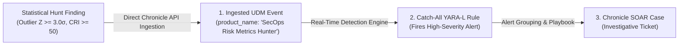

# 🤝 Clean Hand-Off (CH) & Synthetic UDM Event Ingestion Architecture

The **Clean Hand-Off (CH)** protocol defines the standardized data contract produced by the **SecOps Multi-Stage Risk Metrics Skill**. It powers direct API ingestion into Google SecOps Event Store and enables structured escalation into Google SecOps Cases.

---

## 1. 🏛️ The Event-to-Alert-to-Case Promotion Lifecycle

Pushing a statistical hunt finding natively leverages Google SecOps's event-driven detection pipeline:



### Affirmative Intent Steering & Scope Demarcation:
* **Fulfilling Alert & Escalation Requests**: When an analyst requests an alert, notification, case, or event submission for hunt findings (*"create a UDM alert"*, *"alert on this"*, *"send this in"*, *"escalate"*, *"log in Chronicle"*, *"generate synthetic event"*, *"push to Chronicle"*), the agent **affirmatively fulfills the request through the Clean Hand-Off (CH) Protocol** by producing synthetic UDM security events mapped to the tenant's catch-all detection rule (`secops_risk_metrics_synthetic_alert_catchall`).
* **Steering Streaming Rule Requests**: When an analyst explicitly asks to author, test, or deploy persistent detection rules for continuous future telemetry streams, the agent affirmatively steers them to the dedicated detection engineering skills (`secops-detection-engineering` or `secops-yara-l`).

### 1:1 Ingestion Cardinality Standard:
* **One Event Per Outlier Entity**: Exactly **1 synthetic UDM event is emitted per outlier entity** that breached statistical significance thresholds ($Z \ge 3.0\sigma$, $\text{CRI} \ge 50$). 
* **Zero Noise on Nominal Fleet**: Non-outlier entities ($Z < 2.0\sigma$) are not ingested.
* **Hunt Campaign ID Correlation**: All events generated from a single hunt sweep share a common `target.resource.attribute.labels: [{"key": "Hunt Campaign ID", "value": "<campaign_id>"}]` and `metadata.ingestion_labels: [{"key": "hunt_campaign_id", "value": "<campaign_id>"}]`.

### 📦 Multi-Event Batch Ingestion Standard (Multiple Findings):
* **Batching Multiple Outliers**: When a hunt identifies multiple outlier entities or concurrent threat vectors (e.g. dual exfiltration and credential attack), the agent generates a distinct synthetic UDM record for each finding.
* **Correlated Batch Payload**: The events are structured together as a JSON array payload:
  ```json
  [
    { "udm": { "... Event 1 Finding ..." } },
    { "udm": { "... Event 2 Finding ..." } }
  ]
  ```
* **Batched Pre-Clearance Card**: The clearance presentation provides an indexed summary of each finding before submission.

### 🚫 Strict Anti-Case-Comment Pollution Prohibition (With Active Case Exception):
* **No Arbitrary Case Hijacking**: When an analyst requests general escalation (*"Send a report about this to Google SecOps"*, *"Escalate to SecOps"*, or *"Log in Chronicle"*), the agent performs direct API ingestion to Chronicle rather than attaching comments to arbitrary open cases (such as unrelated `SCC_ETD_Alert` cases).
* **Carved-Out Active Case Exception**: If the analyst is actively reviewing a specific case and explicitly instructs the agent to attach the findings to that specific case (e.g. *"Attach this finding to Case 11075"*, *"Add this report to the case wall of Case 11075"*), the agent is authorized to call `create_case_comment(case_id="<ID>", comment=...)` targeting that explicitly designated case.
* **Mandatory Default Path**: When no specific Case ID is requested, the agent generates the synthetic UDM event JSON, previews it to the user, and ingests it directly into Chronicle upon authorization.

---

## 2. 🛡️ The Chronicle Catch-All Case Promotion Rule

To automatically promote ingested synthetic events into **Alerts** and **SOAR Cases**, the customer tenant maintains this persistent detection rule:

```yara
rule secops_risk_metrics_synthetic_alert_catchall {
  meta:
    author = "Greg Kushmerek"
    description = "Catches synthetic risk metrics outlier findings and promotes them to Alerts/Cases"
    severity = "HIGH"

  events:
    $e.metadata.product_name = "SecOps Risk Metrics Hunter"
    $e.metadata.event_type = "GENERIC_EVENT"
    $e.security_result.risk_score >= 50

    // Bind entity for case grouping
    $user = $e.principal.user.userid
    $host = $e.principal.asset.hostname

  match:
    $user, $host over 5m

  outcome:
    $risk_score = max($e.security_result.risk_score)
    $model = array_distinct($e.target.resource.attribute.labels.value)
    $summary = array_distinct($e.security_result.summary)
    $commands = array_distinct($e.security_result.detection_fields["sample_commands"])
    $hashes = array_distinct($e.principal.process.file.sha256)

  condition:
    $e
}
```

---

## 3. 📋 The 9 Canonical `product_event_type` Schemas

### 1. `VOLUMETRIC_BASELINE_ANOMALY` (Standard Z-Score, MAD, CV)
```json
{
  "udm": {
    "metadata": {
      "event_timestamp": "2026-08-26T21:00:00Z",
      "ingested_timestamp": "2026-08-26T21:00:00Z",
      "product_name": "SecOps Risk Metrics Hunter",
      "vendor_name": "Google SecOps",
      "event_type": "GENERIC_EVENT",
      "product_event_type": "VOLUMETRIC_BASELINE_ANOMALY",
      "description": "Volumetric Egress Anomaly: host-042 breached 30d baseline by +4.82σ (CRI: 74)",
      "ingestion_labels": [
        { "key": "hunt_campaign_id", "value": "hunt-c7f8a91b" },
        { "key": "source_skill", "value": "secops-risk-metrics-multistage" }
      ]
    },
    "observer": {
      "hostname": "secops-risk-metrics-hunter",
      "application": "Google SecOps Multi-Stage Risk Analytics"
    },
    "principal": {
      "hostname": "host-042.corp.local",
      "asset": { "hostname": "host-042.corp.local" }
    },
    "network": {
      "sent_bytes": 10737418240,
      "received_bytes": 204800
    },
    "target": {
      "resource": {
        "name": "VOLUMETRIC_BASELINE_ANOMALY",
        "resource_type": "RESOURCE_TYPE_UNSPECIFIED",
        "attribute": {
          "labels": [
            { "key": "Hunt Campaign ID", "value": "hunt-c7f8a91b" },
            { "key": "Statistical Model", "value": "Standard Z-Score" },
            { "key": "Observed Volume", "value": "10.0 GB" },
            { "key": "Historical 30d Mean", "value": "120.4 MB" },
            { "key": "Historical 30d StdDev", "value": "20.1 MB" },
            { "key": "Z-Score", "value": "4.82" },
            { "key": "CRI Score", "value": "74" },
            { "key": "Active Baseline Days", "value": "30" }
          ]
        }
      }
    },
    "security_result": [
      {
        "threat_name": "Statistical Outlier: Volumetric Egress Anomaly",
        "threat_id": "T1048.003",
        "threat_id_namespace": "MITRE_ATTACK",
        "category": ["DATA_EXFILTRATION"],
        "category_details": ["VOLUMETRIC_EGRESS_OUTLIER"],
        "action": ["UNKNOWN_ACTION"],
        "risk_score": 74,
        "severity": "HIGH",
        "summary": "Host host-042 transmitted 10.0 GB outbound, exceeding 30-day baseline by +4.82σ.",
        "description": "Multi-stage baseline evaluation detected an anomalous egress surge exceeding statistical significance threshold (Z >= 3.0σ, CRI >= 50).",
        "detection_fields": [
          { "key": "contacted_domains", "value": "storage.googleapis.com, mega.nz" },
          { "key": "mitre_tactics", "value": "TA0010_EXFILTRATION" },
          { "key": "mitre_techniques", "value": "T1048.003" }
        ]
      }
    ]
  }
}
```

### 2. `BURST_CLUSTER_ANOMALY` (Poisson Dispersion & Fano Factor)
```json
{
  "udm": {
    "metadata": {
      "event_timestamp": "2026-08-26T21:00:00Z",
      "ingested_timestamp": "2026-08-26T21:00:00Z",
      "product_name": "SecOps Risk Metrics Hunter",
      "vendor_name": "Google SecOps",
      "event_type": "GENERIC_EVENT",
      "product_event_type": "BURST_CLUSTER_ANOMALY",
      "description": "Super-Poisson Password Spray: 1,420 auth failures in synchronized waves (Fano Factor F=12.4)",
      "ingestion_labels": [
        { "key": "hunt_campaign_id", "value": "hunt-c7f8a91b" },
        { "key": "source_skill", "value": "secops-risk-metrics-multistage" }
      ]
    },
    "observer": {
      "hostname": "secops-risk-metrics-hunter",
      "application": "Google SecOps Multi-Stage Risk Analytics"
    },
    "principal": {
      "ip": "198.51.100.45",
      "asset": { "ip": ["198.51.100.45"] }
    },
    "target": {
      "user": { "userid": "admin_pool" },
      "resource": {
        "name": "BURST_CLUSTER_ANOMALY",
        "resource_type": "RESOURCE_TYPE_UNSPECIFIED",
        "attribute": {
          "labels": [
            { "key": "Hunt Campaign ID", "value": "hunt-c7f8a91b" },
            { "key": "Statistical Model", "value": "Poisson Dispersion / Fano Factor" },
            { "key": "Fano Factor F", "value": "12.4" },
            { "key": "Failed Login Count", "value": "1420" },
            { "key": "Target User Accounts", "value": "85" },
            { "key": "CRI Score", "value": "88" }
          ]
        }
      }
    },
    "security_result": [
      {
        "threat_name": "Statistical Outlier: Super-Poisson Password Spray",
        "threat_id": "T1110.003",
        "threat_id_namespace": "MITRE_ATTACK",
        "category": ["AUTH_VIOLATION", "CREDENTIAL_ACCESS"],
        "category_details": ["CREDENTIAL_SPRAY", "BRUTE_FORCE"],
        "action": ["UNKNOWN_ACTION"],
        "risk_score": 88,
        "severity": "CRITICAL",
        "summary": "Source IP 198.51.100.45 generated 1,420 authentication failures across 85 distinct user accounts with super-Poisson clustering.",
        "description": "Dispersion analysis revealed synchronized wave patterns (Fano Factor F=12.4 >> 1.0) indicating automated distributed credential attack.",
        "detection_fields": [
          { "key": "spray_target_sample", "value": "frank.kolzig, tim.smith, sarah.j" },
          { "key": "mitre_tactics", "value": "TA0006_CREDENTIAL_ACCESS" },
          { "key": "mitre_techniques", "value": "T1110.003" }
        ]
      }
    ]
  }
}
```

### 3. `DISCRETE_RARITY_ANOMALY` (Poisson Rarity on Quiet Hosts)
```json
{
  "udm": {
    "metadata": {
      "event_timestamp": "2026-08-26T21:00:00Z",
      "ingested_timestamp": "2026-08-26T21:00:00Z",
      "product_name": "SecOps Risk Metrics Hunter",
      "vendor_name": "Google SecOps",
      "event_type": "GENERIC_EVENT",
      "product_event_type": "DISCRETE_RARITY_ANOMALY",
      "description": "Discrete Poisson Rarity: vssadmin executed 4 times on quiet host (Expected λ=0.03/day)",
      "ingestion_labels": [
        { "key": "hunt_campaign_id", "value": "hunt-c7f8a91b" },
        { "key": "source_skill", "value": "secops-risk-metrics-multistage" }
      ]
    },
    "observer": {
      "hostname": "secops-risk-metrics-hunter",
      "application": "Google SecOps Multi-Stage Risk Analytics"
    },
    "principal": {
      "hostname": "db-server-01.corp.local",
      "process": {
        "file": { "sha256": "4b82d91f28b..." },
        "command_line": "vssadmin delete shadows /all /quiet"
      }
    },
    "target": {
      "resource": {
        "name": "DISCRETE_RARITY_ANOMALY",
        "resource_type": "RESOURCE_TYPE_UNSPECIFIED",
        "attribute": {
          "labels": [
            { "key": "Hunt Campaign ID", "value": "hunt-c7f8a91b" },
            { "key": "Statistical Model", "value": "Discrete Poisson Rarity" },
            { "key": "Observed Invocations k", "value": "4" },
            { "key": "Expected Daily Arrival λ", "value": "0.03" },
            { "key": "Poisson Z-Score", "value": "5.6" },
            { "key": "CRI Score", "value": "82" }
          ]
        }
      }
    },
    "security_result": [
      {
        "threat_name": "Statistical Outlier: Discrete Poisson Rarity on Quiet Host",
        "threat_id": "T1490",
        "threat_id_namespace": "MITRE_ATTACK",
        "category": ["SUSPICIOUS_ACTIVITY", "POLICY_VIOLATION"],
        "category_details": ["SHADOW_COPY_DELETION", "INHIBIT_SYSTEM_RECOVERY"],
        "action": ["UNKNOWN_ACTION"],
        "risk_score": 82,
        "severity": "HIGH",
        "summary": "Volume shadow copy deletion tool executed 4 times on database server with zero historical baseline.",
        "description": "Poisson rarity calculation identified an arrival probability P(X >= 4) < 1e-6 indicating deliberate recovery inhibition.",
        "detection_fields": [
          { "key": "sample_commands", "value": "vssadmin delete shadows /all /quiet" },
          { "key": "mitre_tactics", "value": "TA0040_IMPACT" },
          { "key": "mitre_techniques", "value": "T1490" }
        ]
      }
    ]
  }
}
```

### 4. `BAYESIAN_SHRINKAGE_ANOMALY` (Poisson-Gamma / Beta-Binomial)
```json
{
  "udm": {
    "metadata": {
      "event_timestamp": "2026-08-26T21:00:00Z",
      "ingested_timestamp": "2026-08-26T21:00:00Z",
      "product_name": "SecOps Risk Metrics Hunter",
      "vendor_name": "Google SecOps",
      "event_type": "GENERIC_EVENT",
      "product_event_type": "BAYESIAN_SHRINKAGE_ANOMALY",
      "description": "Bayesian Belief Updating: frank.kolzig regularized failure rate surge (Bayes Shift 4.3×)",
      "ingestion_labels": [
        { "key": "hunt_campaign_id", "value": "hunt-c7f8a91b" },
        { "key": "source_skill", "value": "secops-risk-metrics-multistage" }
      ]
    },
    "observer": {
      "hostname": "secops-risk-metrics-hunter",
      "application": "Google SecOps Multi-Stage Risk Analytics"
    },
    "principal": {
      "user": { "userid": "frank.kolzig" }
    },
    "target": {
      "resource": {
        "name": "BAYESIAN_SHRINKAGE_ANOMALY",
        "resource_type": "RESOURCE_TYPE_UNSPECIFIED",
        "attribute": {
          "labels": [
            { "key": "Hunt Campaign ID", "value": "hunt-c7f8a91b" },
            { "key": "Statistical Model", "value": "Poisson-Gamma Bayesian Updating" },
            { "key": "Prior Baseline Mean μ", "value": "1.2 reqs/day" },
            { "key": "Prior Variance σ2", "value": "0.4" },
            { "key": "Prior Weight", "value": "75.0%" },
            { "key": "Evidence Weight", "value": "25.0%" },
            { "key": "Posterior Expected Rate", "value": "28.5" },
            { "key": "Bayesian Belief Shift", "value": "4.3x" },
            { "key": "CRI Score", "value": "68" }
          ]
        }
      }
    },
    "security_result": [
      {
        "threat_name": "Statistical Outlier: Bayesian Posterior Surge",
        "threat_id": "T1078",
        "threat_id_namespace": "MITRE_ATTACK",
        "category": ["AUTH_VIOLATION", "SUSPICIOUS_ACTIVITY"],
        "category_details": ["BAYESIAN_SHRINKAGE_ANOMALY"],
        "action": ["UNKNOWN_ACTION"],
        "risk_score": 68,
        "severity": "MEDIUM",
        "summary": "User frank.kolzig exhibited a confirmed 4.3× Bayesian posterior rate surge above stable 30-day baseline.",
        "description": "Hierarchical empirical Bayesian updating demonstrated a statistically significant shift from prior distribution toward high-frequency failure state.",
        "detection_fields": [
          { "key": "mitre_tactics", "value": "TA0006_CREDENTIAL_ACCESS" },
          { "key": "mitre_techniques", "value": "T1078" }
        ]
      }
    ]
  }
}
```

### 5. `PEER_COHORT_BREAKOUT_ANOMALY` (3-Stage Hierarchical Empirical Bayes)
```json
{
  "udm": {
    "metadata": {
      "event_timestamp": "2026-08-26T21:00:00Z",
      "ingested_timestamp": "2026-08-26T21:00:00Z",
      "product_name": "SecOps Risk Metrics Hunter",
      "vendor_name": "Google SecOps",
      "event_type": "GENERIC_EVENT",
      "product_event_type": "PEER_COHORT_BREAKOUT_ANOMALY",
      "description": "Peer Group Outlier: frank.kolzig breached IT Department peer baseline by +4.16σ",
      "ingestion_labels": [
        { "key": "hunt_campaign_id", "value": "hunt-c7f8a91b" },
        { "key": "source_skill", "value": "secops-risk-metrics-multistage" }
      ]
    },
    "observer": {
      "hostname": "secops-risk-metrics-hunter",
      "application": "Google SecOps Multi-Stage Risk Analytics"
    },
    "principal": {
      "user": {
        "userid": "frank.kolzig",
        "department": ["Information Technology"]
      }
    },
    "target": {
      "resource": {
        "name": "PEER_COHORT_BREAKOUT_ANOMALY",
        "resource_type": "RESOURCE_TYPE_UNSPECIFIED",
        "attribute": {
          "labels": [
            { "key": "Hunt Campaign ID", "value": "hunt-c7f8a91b" },
            { "key": "Statistical Model", "value": "Hierarchical Empirical Bayes" },
            { "key": "Peer Cohort Name", "value": "Information Technology" },
            { "key": "Peer Cohort Size N", "value": "2" },
            { "key": "Peer Group Mean", "value": "76.8" },
            { "key": "Peer Group StdDev", "value": "6.3" },
            { "key": "Peer Z-Score", "value": "4.16" },
            { "key": "CRI Score", "value": "67" }
          ]
        }
      }
    },
    "security_result": [
      {
        "threat_name": "Statistical Outlier: Peer Group Breakout",
        "threat_id": "T1078",
        "threat_id_namespace": "MITRE_ATTACK",
        "category": ["AUTH_VIOLATION", "SUSPICIOUS_ACTIVITY"],
        "category_details": ["PEER_COHORT_BREAKOUT_ANOMALY"],
        "action": ["UNKNOWN_ACTION"],
        "risk_score": 67,
        "severity": "MEDIUM",
        "summary": "User frank.kolzig performed 103 authentication operations, exceeding IT Department peer norm by +4.16σ.",
        "description": "Cross-sectional comparison against organizational department roster identified isolated outlier behavior relative to peer group baseline.",
        "detection_fields": [
          { "key": "peer_roster", "value": "frank.kolzig, tim.smith" },
          { "key": "mitre_tactics", "value": "TA0001_INITIAL_ACCESS,TA0006_CREDENTIAL_ACCESS" },
          { "key": "mitre_techniques", "value": "T1078,T1047" }
        ]
      }
    ]
  }
}
```

### 6. `FLEET_NORMALIZED_DELTA_Z` (3-Stage Dual-Baseline Delta-Z)
```json
{
  "udm": {
    "metadata": {
      "event_timestamp": "2026-08-26T21:00:00Z",
      "ingested_timestamp": "2026-08-26T21:00:00Z",
      "product_name": "SecOps Risk Metrics Hunter",
      "vendor_name": "Google SecOps",
      "event_type": "GENERIC_EVENT",
      "product_event_type": "FLEET_NORMALIZED_DELTA_Z",
      "description": "Targeted Delta-Z Outlier: wrk-shasek isolated anomaly (ΔZ = +5.1σ after Patch Tuesday subtraction)",
      "ingestion_labels": [
        { "key": "hunt_campaign_id", "value": "hunt-c7f8a91b" },
        { "key": "source_skill", "value": "secops-risk-metrics-multistage" }
      ]
    },
    "observer": {
      "hostname": "secops-risk-metrics-hunter",
      "application": "Google SecOps Multi-Stage Risk Analytics"
    },
    "principal": {
      "hostname": "wrk-shasek.stackedpads.local",
      "asset": { "hostname": "wrk-shasek.stackedpads.local" }
    },
    "target": {
      "resource": {
        "name": "FLEET_NORMALIZED_DELTA_Z",
        "resource_type": "RESOURCE_TYPE_UNSPECIFIED",
        "attribute": {
          "labels": [
            { "key": "Hunt Campaign ID", "value": "hunt-c7f8a91b" },
            { "key": "Statistical Model", "value": "Dual-Baseline Delta-Z" },
            { "key": "Personal Z-Score", "value": "6.2" },
            { "key": "Fleet Macro Z-Score", "value": "1.1" },
            { "key": "Delta Z Score (ΔZ)", "value": "5.1" },
            { "key": "CRI Score", "value": "78" }
          ]
        }
      }
    },
    "security_result": [
      {
        "threat_name": "Statistical Outlier: Fleet-Normalized Delta-Z Isolation",
        "threat_id": "T1036",
        "threat_id_namespace": "MITRE_ATTACK",
        "category": ["SUSPICIOUS_ACTIVITY"],
        "category_details": ["FLEET_NORMALIZED_DELTA_Z"],
        "action": ["UNKNOWN_ACTION"],
        "risk_score": 78,
        "severity": "HIGH",
        "summary": "Host wrk-shasek experienced a +5.1σ isolated anomaly while the general fleet remained quiet.",
        "description": "Dual-baseline subtraction (personal Z minus fleet macro Z) successfully eliminated macro rollout noise, confirming an isolated entity anomaly.",
        "detection_fields": [
          { "key": "mitre_tactics", "value": "TA0005_DEFENSE_EVASION" },
          { "key": "mitre_techniques", "value": "T1036" }
        ]
      }
    ]
  }
}
```

### 7. `MULTI_SECTOR_THREAT_FUSION` (4-Stage Multi-Sector Fusion)
```json
{
  "udm": {
    "metadata": {
      "event_timestamp": "2026-08-26T21:00:00Z",
      "ingested_timestamp": "2026-08-26T21:00:00Z",
      "product_name": "SecOps Risk Metrics Hunter",
      "vendor_name": "Google SecOps",
      "event_type": "GENERIC_EVENT",
      "product_event_type": "MULTI_SECTOR_THREAT_FUSION",
      "description": "Coordinated Killchain: win-server breached 30d baseline with multi-sector threat distance D = 5.2σ (CRI: 77)",
      "ingestion_labels": [
        { "key": "hunt_campaign_id", "value": "hunt-c7f8a91b" },
        { "key": "source_skill", "value": "secops-risk-metrics-multistage" }
      ]
    },
    "observer": {
      "hostname": "secops-risk-metrics-hunter",
      "application": "Google SecOps Multi-Stage Risk Analytics"
    },
    "principal": {
      "hostname": "win-server.lunarstiiiness.com",
      "asset": { "hostname": "win-server.lunarstiiiness.com" },
      "user": { "userid": "tim.smith_admin" },
      "process": {
        "file": { "sha256": "a9ab5725d4e96e39f5001b4982b1c81f868a081f25e603832709d7449ee946c9" },
        "command_line": "c:\\diskutil.exe /s"
      }
    },
    "target": {
      "hostname": "activedir.stackedpads.local",
      "resource": {
        "name": "MULTI_SECTOR_THREAT_FUSION",
        "resource_type": "RESOURCE_TYPE_UNSPECIFIED",
        "attribute": {
          "labels": [
            { "key": "Hunt Campaign ID", "value": "hunt-c7f8a91b" },
            { "key": "Statistical Model", "value": "4-Stage Multi-Sector Threat Fusion" },
            { "key": "Composite Threat Distance D", "value": "5.2" },
            { "key": "Auth Sector Z-Score", "value": "3.1" },
            { "key": "Process Sector Z-Score", "value": "4.9" },
            { "key": "Network Sector Z-Score", "value": "2.8" },
            { "key": "CRI Score", "value": "77" }
          ]
        }
      }
    },
    "security_result": [
      {
        "threat_name": "Statistical Outlier: Multi-Sector Threat Fusion",
        "threat_id": "T1003.003",
        "threat_id_namespace": "MITRE_ATTACK",
        "category": ["CREDENTIAL_ACCESS", "DATA_EXFILTRATION"],
        "category_details": ["MULTI_SECTOR_THREAT_FUSION"],
        "action": ["UNKNOWN_ACTION"],
        "risk_score": 77,
        "severity": "HIGH",
        "summary": "Coordinated multi-sector attack: credential access followed by rare binary execution and high-volume staging.",
        "description": "Multi-sector orthogonal threat vector fusion identified coordinated killchain activity breaching composite Euclidean threshold (D = 5.2σ >= 3.5σ).",
        "detection_fields": [
          { "key": "sample_commands", "value": "ntdsutil 'ac i ntds' ifm, c:\\diskutil.exe" },
          { "key": "sample_paths", "value": "C:\\Windows\\Temp\\compass.7z, C:\\diskutil.exe" },
          { "key": "mitre_tactics", "value": "TA0006,TA0008,TA0010" },
          { "key": "mitre_techniques", "value": "T1003.003,T1078,T1560" }
        ]
      }
    ]
  }
}
```

### 8. `LONGITUDINAL_CUSUM_DRIFT` (Longitudinal CUSUM Control Chart)
```json
{
  "udm": {
    "metadata": {
      "event_timestamp": "2026-08-26T21:00:00Z",
      "ingested_timestamp": "2026-08-26T21:00:00Z",
      "product_name": "SecOps Risk Metrics Hunter",
      "vendor_name": "Google SecOps",
      "event_type": "GENERIC_EVENT",
      "product_event_type": "LONGITUDINAL_CUSUM_DRIFT",
      "description": "Persistent CUSUM Drift: acc-win11-5 low-and-slow exfiltration (CUSUM S+ = 4.8σ since 2026-08-18)",
      "ingestion_labels": [
        { "key": "hunt_campaign_id", "value": "hunt-c7f8a91b" },
        { "key": "source_skill", "value": "secops-risk-metrics-multistage" }
      ]
    },
    "observer": {
      "hostname": "secops-risk-metrics-hunter",
      "application": "Google SecOps Multi-Stage Risk Analytics"
    },
    "interval": {
      "start_time": "2026-08-18T00:00:00Z",
      "end_time": "2026-08-26T23:59:59Z"
    },
    "principal": {
      "hostname": "acc-win11-5.corp.local",
      "asset": { "hostname": "acc-win11-5.corp.local" }
    },
    "target": {
      "resource": {
        "name": "LONGITUDINAL_CUSUM_DRIFT",
        "resource_type": "RESOURCE_TYPE_UNSPECIFIED",
        "attribute": {
          "labels": [
            { "key": "Hunt Campaign ID", "value": "hunt-c7f8a91b" },
            { "key": "Statistical Model", "value": "Longitudinal CUSUM Drift" },
            { "key": "CUSUM Cumulative S+", "value": "4.8" },
            { "key": "Drift Inception Date", "value": "2026-08-18" },
            { "key": "Daily Residual Rate", "value": "+1.4σ/day" },
            { "key": "Observation Horizon", "value": "14 Days" },
            { "key": "CRI Score", "value": "75" }
          ]
        }
      }
    },
    "security_result": [
      {
        "threat_name": "Statistical Outlier: Longitudinal CUSUM Drift",
        "threat_id": "T1048",
        "threat_id_namespace": "MITRE_ATTACK",
        "category": ["DATA_EXFILTRATION"],
        "category_details": ["LONGITUDINAL_CUSUM_DRIFT"],
        "action": ["UNKNOWN_ACTION"],
        "risk_score": 75,
        "severity": "HIGH",
        "summary": "Host acc-win11-5 accumulated +4.8σ of persistent positive egress drift starting on 2026-08-18.",
        "description": "Sequential cumulative sum analysis detected low-and-slow data transfer consistently exceeding daily expected variance.",
        "detection_fields": [
          { "key": "mitre_tactics", "value": "TA0010_EXFILTRATION" },
          { "key": "mitre_techniques", "value": "T1048" }
        ]
      }
    ]
  }
}
```

### 9. `ENTITY_GRAPH_RARITY_OUTLIER` (Prevalence & First-Seen Novelty)
```json
{
  "udm": {
    "metadata": {
      "event_timestamp": "2026-08-26T21:00:00Z",
      "ingested_timestamp": "2026-08-26T21:00:00Z",
      "product_name": "SecOps Risk Metrics Hunter",
      "vendor_name": "Google SecOps",
      "event_type": "GENERIC_EVENT",
      "product_event_type": "ENTITY_GRAPH_RARITY_OUTLIER",
      "description": "Rare Binary Outlier: win-adfs executed fake DiskUtil binary (Fleet Prevalence = 1 host across 10d)",
      "ingestion_labels": [
        { "key": "hunt_campaign_id", "value": "hunt-c7f8a91b" },
        { "key": "source_skill", "value": "secops-risk-metrics-multistage" }
      ]
    },
    "observer": {
      "hostname": "secops-risk-metrics-hunter",
      "application": "Google SecOps Multi-Stage Risk Analytics"
    },
    "principal": {
      "hostname": "win-adfs.lunarstiiiness.com",
      "process": {
        "file": {
          "sha256": "935c1861df1f4018d698e8b65abfa02d7e9037d8f68ca3c2065b6ca165d44ad2",
          "full_path": "C:\\diskutil.exe"
        },
        "command_line": "c:\\diskutil.exe /extract"
      }
    },
    "target": {
      "resource": {
        "name": "ENTITY_GRAPH_RARITY_OUTLIER",
        "resource_type": "RESOURCE_TYPE_UNSPECIFIED",
        "attribute": {
          "labels": [
            { "key": "Hunt Campaign ID", "value": "hunt-c7f8a91b" },
            { "key": "Statistical Model", "value": "Entity Graph Prevalence & Rarity" },
            { "key": "Prevalence Rolling Max (10d)", "value": "1" },
            { "key": "First Seen Age", "value": "2 Days" },
            { "key": "Process Execution Z-Score", "value": "4.96" },
            { "key": "CRI Score", "value": "77" }
          ]
        }
      }
    },
    "security_result": [
      {
        "threat_name": "Statistical Outlier: Rare Binary Execution",
        "threat_id": "T1204.002",
        "threat_id_namespace": "MITRE_ATTACK",
        "category": ["SOFTWARE_MALICIOUS", "SUSPICIOUS_ACTIVITY"],
        "category_details": ["RARE_BINARY_EXECUTION", "INFANT_INFRASTRUCTURE"],
        "action": ["UNKNOWN_ACTION"],
        "risk_score": 77,
        "severity": "HIGH",
        "summary": "Host win-adfs executed binary seen on only 1 host enterprise-wide with a +4.96σ execution spike.",
        "description": "Cross-sectional fleet prevalence analysis confirmed rare execution signature on enterprise infrastructure.",
        "detection_fields": [
          { "key": "sample_paths", "value": "C:\\diskutil.exe" },
          { "key": "mitre_tactics", "value": "TA0002_EXECUTION" },
          { "key": "mitre_techniques", "value": "T1204.002" }
        ]
      }
    ]
  }
}
```

---

## 4. 🛡️ Ingestion Governance & Explicit Authorization Protocol

### 🚦 Phase 1: Affirmative Request Recognition & Trigger Routing
When an analyst requests an alert, notification, case, or event submission for hunt findings (*"create a UDM alert"*, *"alert on this"*, *"send this in"*, *"escalate"*, *"log in Chronicle"*, *"generate synthetic event"*, *"push to Chronicle"*):
* The agent affirmatively recognizes this as an escalation request for the **Clean Hand-Off (CH) Protocol**.
* The agent generates the synthetic UDM security event(s) matching the tenant's catch-all detection rule (`secops_risk_metrics_synthetic_alert_catchall`).

### 📦 Phase 2: Payload Construction & Multi-Event Batching
* **1:1 Finding Cardinality**: Exactly one UDM event is constructed per outlier entity ($Z \ge 3.0\sigma$, $\text{CRI} \ge 50$).
* **Correlated Batch Structure**: When multiple findings are flagged in a hunt, all events are bound with a shared `Hunt Campaign ID` UUID and combined into a JSON array:
  ```json
  [
    { "udm": { "... Finding 1 ..." } },
    { "udm": { "... Finding 2 ..." } }
  ]
  ```

### 📋 Phase 3: Pre-Ingestion Clearance Card
Before calling any ingestion or case mutation APIs, the agent must present the literal UDM payload preview (or indexed summary of batch findings), display the target customer ID (`8cbac5ae-8267-4da7-b405-cdbc6fa3f1d5`) and project (`gus-sdl`), and yield the turn for analyst authorization:
> *"Would you like me to ingest this Synthetic UDM Security Event (Campaign: `<campaign_id>`) into Google SecOps (`gus-sdl`) to trigger the Catch-All Alert Rule and spawn a Case?"*

### ⚡ Phase 4: Ingestion Execution Architecture & Safe Fallback Ladder

1. **Primary Ingestion Vector: Direct In-Band Chronicle API Ingestion**:
   * When the service account managing the MCP server has standard SecOps IAM roles, transmitting synthetic UDM events is a direct Chronicle API ingestion call.
   * Direct API ingestion requires no physical forwarder infrastructure or forwarder routing.

2. **Forwarder Appliance Routing (Strict Fallback Only)**:
   * The use of a forwarder (`forwarderId`) is strictly a fallback mechanism for segmented on-prem networks or collector pipelines that explicitly require forwarder routing.
   * If forwarder ingestion is used, ensure `forwarderId` references a valid, verified forwarder UUID (never a Pub/Sub Feed ID or placeholder).

3. **Resilient Operational Fallback Ladder (Zero MCP Client Crashes)**:
   * If in-band API ingestion encounters an environment restriction or API error:
     1. **Preserve Context & Stability**: Do not execute speculative tool loops, search through hundreds of parsers, or probe invalid log types.
     2. **Deliver Structured Payload Artifact**: Provide the complete, validated UDM JSON payload (or multi-event batch) in a clean markdown artifact or copyable block for analyst testing and manual promotion.
     3. **Offer In-Band Case Wall Attachment**: Offer direct attachment of the hunt findings to an active investigation or case using `secops-gus:create_case_comment(case_id="<ID>", comment=...)`.

