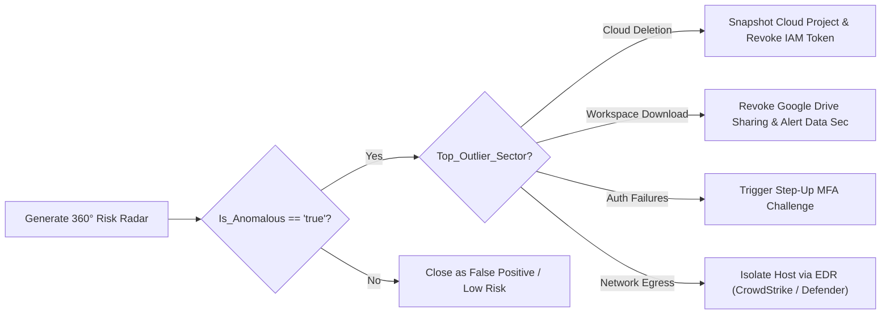

# Chronicle SOAR Playbook Integration: 360° Entity Risk Radar Hook

This guide details how to implement, configure, and execute the **360° Entity Behavioral Risk Radar** as a deterministic, sub-second action block in **Google SecOps (Chronicle SOAR) Case Playbooks**.

---

## 🎯 Overview & Operational Rationale

When a security alert or case triggers in Chronicle SOAR, SOC analysts typically have to manually pivot across multiple dashboards to check:
* Did this user have login spikes?
* Were there cloud resource creations or deletions?
* Were large files downloaded from Google Drive / OneDrive?
* Was there unusual outbound network egress?

The **360° Entity Risk Radar Hook** replaces this manual triage with a single **deterministic playbook action** that fans out concurrent $O(1)$ pre-computed Risk Analytics queries against Chronicle SIEM, calculates standardized $Z$-scores, and pins an interactive **SVG/Markdown Risk Fingerprint** directly to the SOAR Case Wall within 2 seconds of ticket creation.

```mermaid
flowchart TD
    A["🚨 New SOAR Case Created<br>(Entity: tim.smith@altostrat.com)"] --> B["⚙️ Playbook Action Block:<br><b>SecOps - Generate 360° Entity Risk Radar</b>"]
    
    subgraph HookAction ["Deterministic Execution Hook"]
        direction TB
        B --> C["1. Fan-Out 4–5 Pre-Computed UEBA Queries (O(1) lookups)"]
        C --> D["2. Calculate Spoke Z-Scores: (Obs - Mean) / (StdDev + 1.0)"]
        D --> E["3. Calculate Composite Norm: D = sqrt(sum Zi^2) & CRI [0-100]"]
        E --> F["4. Generate Self-Contained SVG Widget & Markdown Table"]
    end
    
    HookAction --> G{"Decision Condition:<br>Composite D >= 3.0σ?"}
    G -->|Yes (High Risk Outlier)| H["🚨 Auto-Escalate Case Priority to Critical<br>📌 Pin SVG Radar Insight to Case Wall<br>🏷️ Add Tag: 'Multi-Sector Anomaly'"]
    G -->|No (Nominal Activity)| I["🟢 Post Informational Radar to Case Wall<br>🏷️ Add Tag: 'Nominal Baseline'"]
```

---

## 🛠️ 1. Chronicle SOAR Custom Action Definition

In Chronicle SOAR (IDE / Integration Management):
1. Navigate to **Integrations** $\to$ **Google SecOps UEBA** (or Custom Integration).
2. Create a new Action: `Generate 360 Entity Risk Radar`.
3. Configure the following parameters:

### Input Parameters:
| Parameter Name | Type | Default | Description |
| :--- | :--- | :--- | :--- |
| `Entity Identifier` | String | `[Alert.Entity]` | The principal user email, userid, or asset hostname. |
| `Entity Type` | Choice (`USER` / `ASSET`) | `USER` | Scope of behavioral metrics to evaluate. |
| `Anomaly Threshold` | Float | `3.0` | Euclidean distance $D$ threshold for flagging anomaly. |

### Output Parameters (Script Results):
| Parameter Name | Type | Description |
| :--- | :--- | :--- |
| `Composite_D` | Float | Multi-sector Euclidean distance ($D = \sqrt{\sum Z_i^2}$). |
| `CRI_Score` | Integer | Calibrated Risk Index $[0–100]$. |
| `Is_Anomalous` | Boolean | `true` if $D \ge \text{Threshold}$, else `false`. |
| `Top_Outlier_Sector` | String | Name of the spoke with the highest positive $Z$-score. |
| `Top_Outlier_Z` | Float | $Z$-score of the primary outlier vector. |

---

## 🐍 2. Native Playbook Action Code (`SiemplifyAction`)

```python
"""Chronicle SOAR Action: Generate 360 Entity Risk Radar.

Author: Greg Kushmerek
Integration: Google SecOps UEBA
"""

from SiemplifyAction import SiemplifyAction
from SiemplifyUtils import output_handler
from scripts.radar_collector import EntityRadarCollector, MetricSpoke


@output_handler
def main():
  siemplify = SiemplifyAction()
  siemplify.script_name = "Generate 360 Entity Risk Radar"

  # 1. Extract Parameters from Playbook Context
  entity_id = siemplify.extract_action_param("Entity Identifier")
  entity_type = siemplify.extract_action_param("Entity Type", default_value="USER")
  threshold = float(siemplify.extract_action_param("Anomaly Threshold", default_value=3.0))

  # 2. Initialize Collector with Chronicle SIEM API Client
  collector = EntityRadarCollector(secops_client=siemplify)

  # 3. Execute Fan-Out & Aggregate Radar
  # (In production, execute_sector_query calls Chronicle udm_search via Siemplify / SecOps API)
  radar_data = collector.collect_360_radar(entity_id=entity_id)

  composite_d = radar_data["composite_distance_d"]
  cri = radar_data["calibrated_risk_index"]
  is_anomalous = composite_d >= threshold

  # 4. Attach SVG Radar Insight Card to Case Wall
  insight_html = f"""
    <div style="font-family: Roboto, sans-serif; padding: 16px; background: #ffffff; border-radius: 8px; border: 1px solid #dadce0;">
        <div style="display: flex; justify-content: space-between; align-items: center; margin-bottom: 12px;">
            <h3 style="margin: 0; color: #202124;">360° Behavioral Risk Fingerprint: <code>{entity_id}</code></h3>
            <span style="background: {'#fce8e6; color: #c5221f;' if is_anomalous else '#e6f4ea; color: #137333;'} padding: 6px 12px; border-radius: 4px; font-weight: bold; font-size: 13px;">
                D = {composite_d:.2f}σ | CRI {cri}/100 ({'ANOMALOUS' if is_anomalous else 'NOMINAL'})
            </span>
        </div>
        <div style="text-align: center; margin: 16px 0;">
            {radar_data["svg_widget"]}
        </div>
        <div style="margin-top: 12px;">
            {radar_data["markdown_table"]}
        </div>
    </div>
    """

  siemplify.add_insight(
      title=f"360° Risk Radar: {entity_id} ({'ANOMALY DETECTED' if is_anomalous else 'NOMINAL'})",
      content=insight_html,
      entity_identifier=entity_id,
      severity=siemplify.SEVERITY_HIGH if is_anomalous else siemplify.SEVERITY_INFO,
  )

  # 5. Populate Script Results for Downstream DAG Branching
  siemplify.result.add_result_value("Composite_D", str(composite_d))
  siemplify.result.add_result_value("CRI_Score", str(cri))
  siemplify.result.add_result_value("Is_Anomalous", "true" if is_anomalous else "false")
  siemplify.result.add_result_value("Top_Outlier_Sector", radar_data["top_outlier_spoke"])
  siemplify.result.add_result_value("Top_Outlier_Z", str(radar_data["top_outlier_z"]))

  output_message = f"360° Risk Radar completed for {entity_id}: D = {composite_d:.2f}σ, CRI = {cri}/100"
  siemplify.end(output_message, is_anomalous)


if __name__ == "__main__":
  main()
```

---

## 📊 3. How the Output Displays on the Case Wall

When the playbook block executes, it creates a rich **Case Wall Insight Card**:
1. **Interactive SVG Polar Grid**: Concentric circles at $+1\sigma$, $+2\sigma$, $+3\sigma$ (red dashed perimeter), with the entity's polygon shaded red if anomalous or blue if nominal.
2. **Hover Tooltips**: Hovering over any spoke reveals exact counts (`Observed Today: 640`, `30d Baseline: 21.3 ± 2.1`, `Z = +3.80σ`).
3. **Structured CommonMark Table**: Tabular breakdown with Unicode visual progress bars (`▰▰▰▰▰▰▰▰▰▱▱`).

---

## 🚦 4. Automated Downstream Playbook Branching

Using the output parameters from this action, SOAR playbooks can make automated deterministic decisions:



---

## 🛑 5. The Monolithic 5-Stage Join Trap & Decoupled Micro-Query Guarantee

### Why Monolithic 5-Stage YARA-L Joins Fail in Chronicle SIEM
When evaluating an entity across 5 orthogonal vectors (Auth, Cloud, Workspace, Net, DNS), attempting to combine all 5 sectors into a single monolithic YARA-L rule is a severe architectural anti-pattern (`STAT_ANTIPATTERN_MONOLITHIC_RADAR_JOIN`):

```yara
// ❌ ANTI-PATTERN: Monolithic 5-Sector Inner Join (COMPILER ERROR & SILENT DROP)
stage s1_auth { ... match: $user by 1d ... }
stage s2_cloud { ... match: $user by 1d ... }
stage s3_work { ... match: $user by 1d ... }
stage s4_net { ... match: $user by 1d ... }
stage s5_dns { ... match: $user by 1d ... }

$user = $s1_auth.user
$user = $s2_cloud.user
$user = $s3_work.user
$user = $s4_net.user
$user = $s5_dns.user
match: $user by 1d
outcome:
  $d_sq = ($s1_auth.z)^2 + ($s2_cloud.z)^2 + ($s3_work.z)^2 + ($s4_net.z)^2 + ($s5_dns.z)^2
```

This constructs two fatal failure modes:
1. **Chronicle Compiler Limit (`maxJoinCount = 4`)**:
   Chronicle SIEM strictly caps multi-stage joins at `maxJoinCount = 4`. A query attempting to join 5 stages exceeds the compiler limit and triggers an unrecoverable compilation error.
2. **Silent Inner-Join Drop**:
   In YARA-L 2.0 DAGs, cross-stage joins are **strict inner joins**. If the target entity had zero cloud resource modifications or zero Google Workspace downloads on that particular date, that stage produces zero rows. Joining with an empty stage drops the entity completely from the query results, yielding 0 rows across all sectors.

### The Decoupled 5-Sector Architecture & `radar_collector.py`
To guarantee zero compilation errors and prevent silent drops:
* Execute 5 lightweight, independent sector micro-queries in parallel (each evaluating 1 sector against its 30-day baseline).
* If a sector returns 0 events for the target entity, record nominal baseline ($Z = 0.00\sigma, \text{CRI} = 0$).
* Feed the resulting vector scores into the deterministic CLI visualizer:
  ```bash
  python3 scripts/radar_collector.py \
    --entity "<entity_id>" \
    --scores "auth=<Z1>,cloud=<Z2>,workspace=<Z3>,net=<Z4>,dns=<Z5>" \
    --output "<artifact_dir>/radar_<entity_id>.html" \
    --format embed
  ```
* Under `--format embed`, the collector writes both `.html` and companion `.svg` files to disk, and outputs *only* `<agent-embed src="file://..."></agent-embed>` and the companion link into chat. Chat markdown remains 100% free of raw SVG code or ASCII formatting artifacts.

---

## 6. Pre-Flight Clearance & Query Integrity Protocol for 360 Radar (Release v1.4.4)

### A. Turn 1 Pre-Flight Clearance Hard Gate (NO QUERY = NO CLEARANCE)
When conducting a 360° Entity Behavioral Risk Radar hunt:
1. **Mandatory Upfront Query Preview**: The agent must display the compilable micro-query template representing the 5-sector decoupled evaluation.
2. **Strict Compiler Probe Requirement**: Before displaying ````yara in markdown, the probe query must be validated via `secops-gus:udm_search` with ISO 8601 timestamps (`startTime="<ISO_10M_AGO>"`, `endTime="<ISO_NOW>"`). Relative strings like `"now-10m"` are forbidden.
3. **Hard Pre-Flight Clearance Gate**: If the query cannot be probed or compiled, the clearance question (Step 5) MUST NOT be asked. The agent must halt immediately and report what blocked query compilation.

### B. Turn 2 Execution Integrity (Prohibition of Raw UDM Filters in Pillar 2)
1. **Executed Multi-Stage Micro-Queries**: In Step 2 (Pillar 2), the agent must display the literal executed multi-stage YARA-L micro-queries passed into `secops-gus:udm_search(query=...)`.
2. **Raw Filter Prohibition**: Replacing multi-stage YARA-L with a raw event filter (e.g., `principal.user.userid = "greg" or target.user.userid = "greg"`) violates Pillar 2 integrity and produces meaningless all-zero visual coordinates.

---
*Created and maintained by Greg Kushmerek for Google SecOps Chronicle SIEM threat hunting workflows.*
