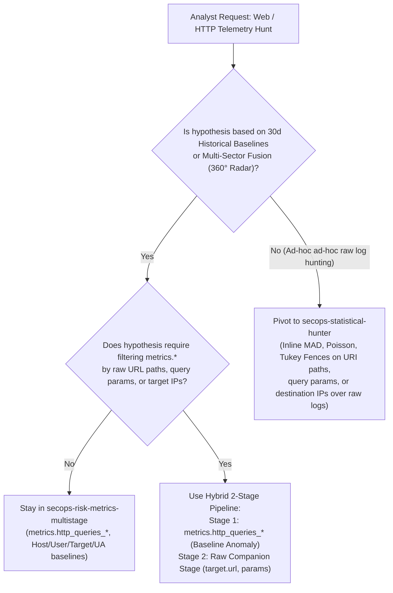
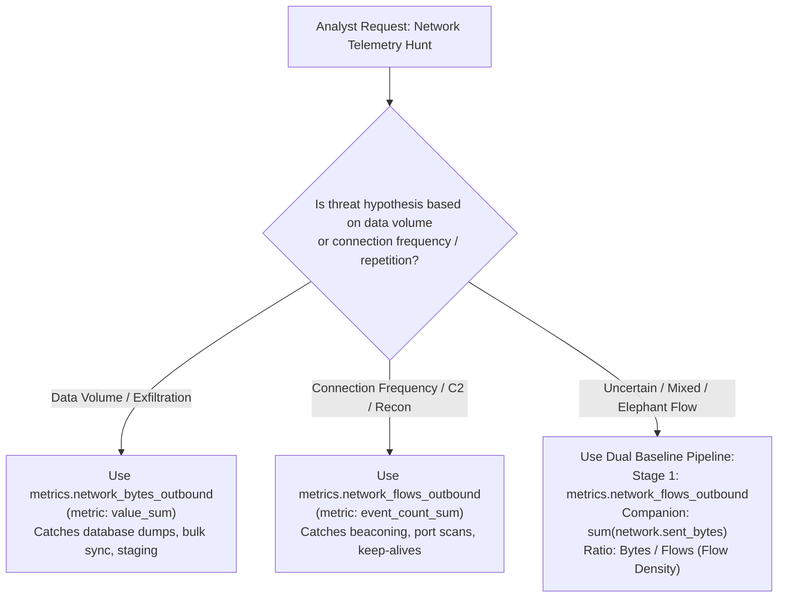

# 📖 Canonical UDM Hunting Field Dictionary

This reference provides the authoritative, compiler-verified field paths from Google SecOps's core Unified Data Model (`//depot/google3/googlex/security/malachite/proto/external/udm.proto`).

Use this dictionary whenever instantiating multi-stage YARA-L templates, authoring raw telemetry companion stages (UDM_EVENTS), or constructing manual triage pivots.

---

## ⚡ The Top 6 Invariant Schema Rules & Anti-Hallucination Traps

| Telemetry Domain | Canonical UDM Protobuf Path | Legacy / Deprecated Field Aliases (Mapped to Canonical) | `udm.proto` Anchor |
| :--- | :--- | :--- | :--- |
| **HTTP User-Agent** | `network.http.user_agent` | `target.user_agent`, `target.http.user_agent`, `http.user_agent` | Line 3889 |
| **HTTP Methods & Headers** | `network.http.method` `network.http.referral_url` `network.http.response_code` | `target.method` `target.http.referral_url` `network.response_code` | Lines 3878, 3881, 3893 |
| **Target URL & Hostname** | `target.url` `target.hostname` | `network.http.url` `network.url` | Lines 5698, 5773 |
| **Network Volumes** | `network.sent_bytes` `network.received_bytes` | `network.bytes_sent`, `network.client_bytes`, `network.sentBytes`, `network.bytes` | Lines 836, 839 |
| **Network Protocols** | `network.ip_protocol` (L4: `"TCP"`, `"UDP"`) `network.application_protocol` (L7: `"HTTP"`, `"DNS"`) | `network.protocol = "TCP"` `network.transport_protocol` | Lines 921, 928 |
| **Process Executables** | `principal.process.file.full_path` `principal.process.file.sha256` `principal.process.file.md5` | `principal.process.path`, `target.process.path`, `principal.process.sha256` | Lines 2584, 2599 |
| **Process Invocation** | `principal.process.command_line` `principal.process.pid` | `principal.process.cmdline`, `principal.command_line` | Lines 1734, 1748 |
| **Cloud Resource Access** | `target.resource.name` `target.resource.resource_type` | `target.resource_name`, `target.cloud.resource`, `resource.name` | Line 5845 |

---

## 1. Web & HTTP Telemetry (`metadata.event_type = "NETWORK_HTTP"`)

In HTTP telemetry, requested destination endpoints and protocol transport headers are cleanly split across the `Noun` (`target`) and the `Network` (`network.http`) messages:

### Canonical Fields:
- **User-Agent String**: `network.http.user_agent`
- **HTTP Method**: `network.http.method` (`"GET"`, `"POST"`, `"PUT"`, `"DELETE"`)
- **HTTP Status Code**: `network.http.response_code` (`200`, `302`, `404`, `500`)
- **Referrer URL**: `network.http.referral_url`
- **Target URL**: `target.url` (e.g. `https://login.corp.com/api/v1/auth`)
- **Target Hostname**: `target.hostname` (e.g. `login.corp.com`)
- **Target Port**: `target.port` (`80`, `443`, `8080`)
- **Source IP / Asset**: `principal.ip` or `principal.asset.ip`
- **Source Client Hostname**: `principal.asset.hostname`

### 1.1 Malachite Metric Alignment Matrix (`events:` Block vs. `metrics.http_queries_*`)
To guarantee metrics integrity, align the raw event query in `events:` with the underlying Malachite pre-computed tables:

| Telemetry Concept | Raw `events:` Section Path | Metric Table Handling (`metrics.http_queries_*`) | Canonical Multi-Stage Placement & Pattern |
| :--- | :--- | :--- | :--- |
| **Client Host** | `principal.asset.hostname = $host` | Dimension: `principal.asset.hostname` | **Stage 1 Filter**: Pass directly to `metrics.http_queries_*(principal.asset.hostname: $host)`. |
| **Client Device IP** | `principal.asset.ip = $ip` | Dimension: `principal.asset.ip` | **Stage 1 Filter**: Pass directly to `metrics.http_queries_*(principal.asset.ip: $ip)`. |
| **User Identity** | `principal.user.userid = $user` | Dimension: `principal.user.userid` | **Stage 1 Filter**: Pass directly to `metrics.http_queries_*(principal.user.userid: $user)`. |
| **Target Hostname** | `target.hostname = $target_host` | Dimension: `target.hostname` | **Stage 1 Filter**: Pass directly to `metrics.http_queries_*(target.hostname: $target_host)`. |
| **HTTP User-Agent** | `network.http.user_agent = $ua` | Dimension: `network.http.user_agent` | **Stage 1 Compound**: Combine with host/user in `metrics.http_queries_*`. |
| **HTTP Status Code** | `network.http.response_code` | Pre-Partitioned Metric Shards | **Metric Selection**: Query `metrics.http_queries_fail` (for $\ge 400$) or `metrics.http_queries_success` (for $< 400$). |
| **HTTP Method** | `network.http.method != ""` | Ingest Gate Pre-Filter | **Ingest Gate**: Filter in raw `events:` block; pre-applied by engine across all HTTP metric tables. |
| **Target URL / URI** | `target.url = $url` | Forensic Companion Field | **Stage 2 Companion**: Project as forensic proof (`outcome: array_distinct(target.url)`). |
| **Target IP** | `target.ip = $tip` | Forensic Companion Field | **Stage 2 Companion**: Aggregate destination IPs in companion stage; use `target.hostname` for metric baselines. |

### 1.2 Affirmative AST Compiler & Placement Rules:
* **Rule 1 (Target Dimension)**: Pass `target.hostname` to `metrics.http_queries_*`. When investigating specific URI paths, project `$sample_uris = array_distinct(target.url)` in a Stage 2 companion block.
* **Rule 2 (User-Agent Path)**: Bind client browser strings to `network.http.user_agent` (UDM protobuf line 3889).
* **Rule 3 (Response Code Partitioning)**: Query `metrics.http_queries_fail` directly for errors ($4xx/5xx$) and `metrics.http_queries_success` for clean transactions ($< 400$).
* **Rule 4 (Destination IP Routing)**: To baseline external destination IPs rather than domain hostnames, route to `metrics.dns_bytes_outbound` or `secops-statistical-hunter`.

### 1.3 Decision Framework: When to Stay in Risk Metrics vs. When to Pivot to Statistical Hunter

* **Stay in `secops-risk-metrics-multistage` when:**
  - Baselining request volume, failure rates, or unique user-agents against 30-day historical distributions.
  - Conducting 360° Behavioral Risk Radar profiling across orthogonal sectors (Spoke 6: Web & Proxy).
  - Normalizing host/user user-agent adoption against enterprise-wide fleet prevalence.
* **Pivot to `secops-statistical-hunter` when:**
  - The analyst explicitly seeks ad-hoc statistical outlier detection over raw URI strings (e.g., path entropy, high-frequency parameter fuzzing).
  - Baselining target IP addresses without domain resolution.
  - Analyzing HTTP payload transfer sizes, byte distributions, or header field anomalies not captured in pre-computed metric tables.

---

## 2. Network Flow & Connection Telemetry (`NETWORK_FLOW`, `NETWORK_CONNECTION`)

Netflow, firewall sessions, and VPC flow logs represent transfer volume and layer-specific protocols under the `network` block:

### Canonical Fields:
- **Egress (Outbound) Bytes**: `network.sent_bytes` (`uint64`)
- **Ingress (Inbound) Bytes**: `network.received_bytes` (`uint64`)
- **Total Bytes**: `network.total_bytes` (`int64`)
- **Packets Sent / Received**: `network.sent_packets`, `network.received_packets`
- **Session Duration**: `network.session_duration.seconds` (`int64`)
- **Traffic Direction**: `network.direction` (`OUTBOUND`, `INBOUND`, `BROADCAST`, `UNKNOWN_DIRECTION`)
- **Transport Protocol (L4)**: `network.ip_protocol` (`"TCP"`, `"UDP"`, `"ICMP"`, `"GRE"`)
- **Application Protocol (L7)**: `network.application_protocol` (`"HTTP"`, `"DNS"`, `"SSH"`, `"FTP"`, `"SMTP"`)
- **Source Device Hostname**: `principal.asset.hostname`
- **Source Device IP**: `principal.asset.ip` or `principal.ip`
- **Target Destination IP**: `target.ip`
- **Target Destination Port**: `target.port`

### 2.1 Malachite Metric Alignment Matrix (`events:` Block vs. `metrics.network_*`)
To guarantee metrics integrity, align the raw event query in `events:` with the underlying Malachite pre-computed tables:

| Telemetry Concept | Raw `events:` Section Path | Metric Table Handling (`metrics.network_*`) | Canonical Multi-Stage Placement & Pattern |
| :--- | :--- | :--- | :--- |
| **Outbound Bytes** | `network.sent_bytes != 0` | `metrics.network_bytes_outbound` | **Stage 1 Volumetric**: Pass `metric: value_sum` to measure byte volume. |
| **Inbound Bytes** | `network.received_bytes != 0` | `metrics.network_bytes_inbound` | **Stage 1 Volumetric**: Pass `metric: value_sum` to measure byte volume. |
| **Outbound Flows** | `network.sent_bytes != 0` | `metrics.network_flows_outbound` | **Stage 1 Session Count**: Pass `metric: event_count_sum` to measure flow count. |
| **Inbound Flows** | `network.received_bytes != 0` | `metrics.network_flows_inbound` | **Stage 1 Session Count**: Pass `metric: event_count_sum` to measure flow count. |
| **Client Host** | `principal.asset.hostname = $host` | Dimension: `principal.asset.hostname` | **Stage 1 Filter**: Pass directly to `metrics.network_*(principal.asset.hostname: $host)`. |
| **Client Device IP** | `principal.asset.ip = $ip` | Dimension: `principal.asset.ip` | **Stage 1 Filter**: Pass directly to `metrics.network_*(principal.asset.ip: $ip)`. |
| **User Identity** | `principal.user.userid = $user` | Dimension: `principal.user.userid` | **Stage 1 Filter**: Pass directly to `metrics.network_*(principal.user.userid: $user)`. |
| **Target Destination IP** | `target.ip = $dst_ip` | Forensic Companion Field | **Stage 2 Companion**: Aggregate destination IPs (`$distinct_dst_ips = count_distinct(target.ip)`). |
| **Target Destination Port**| `target.port = $dst_port` | Forensic Companion Field | **Stage 2 Companion**: Aggregate target ports (`$distinct_dst_ports = count_distinct(target.port)`). |
| **Event Type** | `metadata.event_type = "NETWORK_CONNECTION"` | Ingest Gate Pre-Filter | **Ingest Gate**: Filter in raw `events:` block for session correlation. |

### 2.2 Affirmative AST Compiler & Placement Rules:
* **Rule 5 (Flow Aggregation)**: Always pass `metric: event_count_sum` when evaluating `metrics.network_flows_*`.
* **Rule 6 (Byte Aggregation)**: Pass `metric: value_sum` for byte volume aggregations (`avg`, `stddev`, `max`, `sum`) on `metrics.network_bytes_*`; reserve `metric: event_count_sum` strictly for `agg: num_metric_periods`.
* **Rule 7 (Target IP Dispersion)**: Baseline host/user with `metrics.network_flows_outbound(principal.asset.hostname: $host)` and project `$distinct_dst_ips = count_distinct(target.ip)` in companion stage.
* **Rule 8 (Network Protocol & Volume Paths)**: Specify L4 transport protocols via `network.ip_protocol` (`"TCP"`, `"UDP"`) and transfer volumes via `network.sent_bytes` / `network.received_bytes`.

### 2.3 Decision Framework: Volumetric Egress vs. Session Frequency

---

## 3. Endpoint Process Telemetry (`PROCESS_LAUNCH`, `PROCESS_INJECTION`)

Process execution events model the binary image as a `File` sub-message within `Process`:

### Canonical Fields:
- **Executable Full Path**: `principal.process.file.full_path` (or `target.process.file.full_path`)
- **Executable Hash**: `principal.process.file.sha256`, `principal.process.file.md5`
- **Executable File Size**: `principal.process.file.size`
- **Command Line**: `principal.process.command_line`
- **Process ID**: `principal.process.pid`
- **Parent Process Command Line**: `principal.process.parent_process.command_line`
- **Parent Process Executable Path**: `principal.process.parent_process.file.full_path`
- **Executing User**: `principal.user.userid`
- **Executing Machine**: `principal.asset.hostname`

### Anti-Pattern Traps:
❌ **INVALID**: `principal.process.path = "/usr/bin/curl"`  
✅ **VALID**: `principal.process.file.full_path = "/usr/bin/curl"`

❌ **INVALID**: `principal.process.sha256 = "..."`  
✅ **VALID**: `principal.process.file.sha256 = "..."`

❌ **INVALID**: `metrics.file_executions_total(target.process.file.sha256: $token)`  
✅ **VALID**: `metrics.file_executions_total(principal.process.file.sha256: $token)` *(Chronicle metric index strictly uses principal.process.file.sha256)*

### 3.1 Malachite Metric Alignment Matrix (`events:` Block vs. `metrics.file_executions_*`)
To guarantee metrics integrity, align the raw event query in `events:` with the underlying Malachite pre-computed tables:

| Telemetry Concept | Raw `events:` Section Path | Metric Table Handling (`metrics.file_executions_*`) | Canonical Multi-Stage Placement & Pattern |
| :--- | :--- | :--- | :--- |
| **Binary SHA256 Hash** | `principal.process.file.sha256 = $sha` | Mandatory Dimension: `principal.process.file.sha256` | **Stage 1 Filter**: Pass directly to `metrics.file_executions_*(..., principal.process.file.sha256: $sha)`. **CRITICAL**: Never pass `target.process.file.sha256` (unindexed, compiler rejection). |
| **Executing Machine Host** | `principal.asset.hostname = $host` | Dimension: `principal.asset.hostname` | **Stage 1 Filter**: Pass directly to `metrics.file_executions_*(principal.asset.hostname: $host)`. |
| **Executing User** | `principal.user.userid = $user` | Dimension: `principal.user.userid` | **Stage 1 Filter**: Pass directly to `metrics.file_executions_*(principal.user.userid: $user)`. |
| **Event Type Ingest Gate** | `metadata.event_type = "PROCESS_LAUNCH"` | Mandatory Companion Dimension | **Stage 1 Ingest Gate**: Pass `metadata.event_type: $event_type` where `$event_type = metadata.event_type`. Required by Chronicle SIEM compiler. |
| **Execution Status Shards** | N/A | Pre-Partitioned Metric Shards | **Metric Selection**: Query `metrics.file_executions_total` (all launches), `metrics.file_executions_fail` (blocked/failed), or `metrics.file_executions_success`. |
| **Process Command Line** | `principal.process.command_line = $cmd` | Forensic Companion Field | **Stage 1/2 Outcome**: Project as forensic proof (`outcome: array_distinct(principal.process.command_line)`). Unindexed in metrics. |
| **Executable Full Path** | `principal.process.file.full_path = $path` | Forensic Companion Field | **Stage 1/2 Outcome**: Project as forensic proof (`outcome: array_distinct(principal.process.file.full_path)`). Unindexed in metrics. |

### 3.2 Affirmative AST Compiler & Placement Rules:
* **Rule 9 (Process Binary Path Invariant)**: In `metrics.file_executions_*`, binary hash MUST ALWAYS be mapped via `principal.process.file.sha256`. Passing `target.process.file.sha256` or `principal.process.sha256` causes an immediate Chronicle compiler error (`Request contains an invalid argument`).
* **Rule 10 (Mandatory Event Type Companion)**: In `metrics.file_executions_*`, `$event_type` MUST be bound to `metadata.event_type` and passed as `metadata.event_type: $event_type` (or literal `"PROCESS_LAUNCH"`).
* **Rule 11 (Token-Centric Fleet Normalization)**: For fleet prevalence normalization (Patch Tuesday Shield), match by `$token by 1d` where `$token` is bound to `principal.process.file.sha256` in both Stage 1 and Stage 2.

---

## 4. User Authentication Telemetry (`USER_LOGIN`, `USER_LOGOUT`)

Authentication logs must cleanly differentiate the client/source from the identity/target being authenticated:

### Canonical Fields:
- **Target User Account**: `target.user.userid` (the account authenticated into)
- **Target User Email**: `target.user.email_addresses`
- **Originating User**: `principal.user.userid` (often service/system or equal to target)
- **Source Hostname**: `principal.asset.hostname`
- **Source IP**: `principal.ip` or `principal.asset.ip`
- **Target Destination Host**: `target.asset.hostname` (the server/host receiving authentication)
- **Logon Type / Mechanism**: `extensions.auth.type` (e.g. `INTERACTIVE`, `REMOTE_INTERACTIVE`, `SERVICE`)
- **Authentication Result**: `security_result.action` (`ALLOW`, `BLOCK`)

### 4.1 Malachite Metric Alignment Matrix (`events:` Block vs. `metrics.auth_attempts_*`)
To guarantee metrics integrity, align the raw event query in `events:` with the underlying Malachite pre-computed tables:

| Telemetry Concept | Raw `events:` Section Path | Metric Table Handling (`metrics.auth_attempts_*`) | Canonical Multi-Stage Placement & Pattern |
| :--- | :--- | :--- | :--- |
| **Target User Account** | `target.user.userid = $user` | Dimension: `target.user.userid` | **Stage 1 Filter**: Pass directly to `metrics.auth_attempts_*(target.user.userid: $user)`. |
| **Source Client Host** | `principal.asset.hostname = $host` | Dimension: `principal.asset.hostname` | **Stage 1 Filter**: Pass directly to `metrics.auth_attempts_*(principal.asset.hostname: $host)`. |
| **Source Client IP** | `principal.asset.ip = $ip` | Dimension: `principal.asset.ip` | **Stage 1 Filter**: Pass directly to `metrics.auth_attempts_*(principal.asset.ip: $ip)`. |
| **Auth Result Shards** | `security_result.action` | Pre-Partitioned Metric Shards | **Metric Selection**: Query `metrics.auth_attempts_fail` (for failed/brute-force) or `metrics.auth_attempts_total`. |

### 4.2 Affirmative AST Compiler & Placement Rules:
* **Rule 12 (Target User Affinity)**: For user authentication baselines, pass `target.user.userid: $user` (the authenticated account).
* **Rule 13 (Asset Origin Affinity)**: For host authentication baselines, pass `principal.asset.hostname: $host` (the originating client).

---

## 5. Cloud Resource Operations (`USER_RESOURCE_CREATION`, `USER_RESOURCE_UPDATE_CONTENT`, etc.)

Cloud control plane operations (GCP Cloud Audit Logs, AWS CloudTrail, Azure Activity Logs) describe modified resources under `target.resource`:

### Canonical Fields:
- **Resource Identifier / URI**: `target.resource.name`
- **Resource Category**: `target.resource.resource_type` (e.g. `"storage.googleapis.com/Bucket"`, `"compute.googleapis.com/Instance"`)
- **Resource Sub-Type**: `target.resource.resource_subtype`
- **Acting Principal**: `principal.user.userid` or `principal.user.email_addresses`
- **Service Name**: `target.application` (e.g. `"storage.googleapis.com"`, `"bigquery.googleapis.com"`)
- **Vendor / Product**: `metadata.vendor_name`, `metadata.product_name`

### 5.1 Malachite Metric Alignment Matrix (`events:` Block vs. `metrics.resource_*`)
To guarantee metrics integrity, align the raw event query in `events:` with the underlying Malachite pre-computed tables:

| Telemetry Concept | Raw `events:` Section Path | Metric Table Handling (`metrics.resource_*`) | Canonical Multi-Stage Placement & Pattern |
| :--- | :--- | :--- | :--- |
| **Acting Identity** | `principal.user.userid = $sa` | Dimension: `principal.user.userid` | **Stage 1 Match Key**: Service account or user ID (`$sa by 1d`). |
| **Vendor Name** | `metadata.vendor_name = $vendor` | Mandatory Dimension | **Stage 1 Companion**: Bind `$vendor` and pass `metadata.vendor_name: $vendor`. |
| **Product Name** | `metadata.product_name = $product` | Mandatory Dimension | **Stage 1 Companion**: Bind `$product` and pass `metadata.product_name: $product`. |
| **Resource Identifier** | `target.resource.name = $res` | Dimension | **Stage 1 Companion**: Bind `$res` and pass `target.resource.name: $res`. |

---

## 6. Security & EDR Rule Alerts Telemetry (`metadata.event_type = "SCAN_UNCATEGORIZED"`)

Rule alerts and EDR detections operate as a compound baseline requiring rule name binding:

### 6.1 Malachite Metric Alignment Matrix (`events:` Block vs. `metrics.alert_event_name_count`)
| Telemetry Concept | Raw `events:` Section Path | Metric Table Handling (`metrics.alert_event_name_count`) | Canonical Multi-Stage Placement & Pattern |
| :--- | :--- | :--- | :--- |
| **Rule / Alert Name** | `security_result.rule_name = $rule_name` | Mandatory Companion Dimension | **Stage 1 Filter**: Pass `security_result.rule_name: $rule_name`. Mandatory companion dimension. |
| **Event Type** | `metadata.event_type = "SCAN_UNCATEGORIZED"` | Mandatory Ingest Gate | **Stage 1 Filter**: Pass `metadata.event_type: "SCAN_UNCATEGORIZED"`. |
| **Target Entity** | `principal.asset.hostname = $host` or `principal.user.userid = $user` | Dimension: `principal.asset.hostname` or `principal.user.userid` | **Stage 1 Match Key**: Bind entity match key (`$host` or `$user`). |
